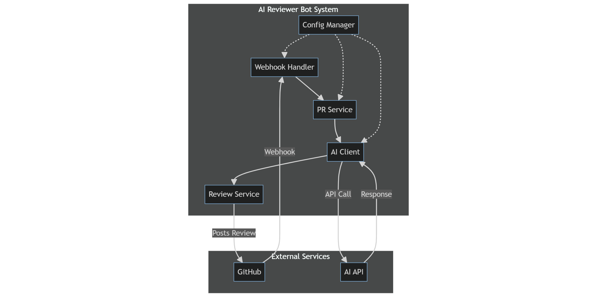

# Что это

[Проект](https://github.com/45161846/neuro-review) представляет из себя автоматизированного нейро-ревьювера pull-request'ов на GitHub.

Работая на одном лишь токене на чтение репы и силе промт-инженирии приложение предоставляет пользователю дешевую и низкокачественную оценку кода всего за считанные секунды

# POV пользователя
После подключения web-хука к репозиторию, на каждый push в каждый pr будет создаваться отзыв по коду, сгенерированный на диффе:

#### Краткое описание pr

#### Криты:
- filename
- line
- описание проблемы
- степень
- How to fix

#### Улучшения:
- filename
- line
- тип: optimization/style/bug
- How to fix
- priority

#### overall_quality_score

# Как устроено
Механизм предельно прост: 

# Работа

Наша команда разработчика реализовала такие части как:

- небольшой хэндлер эндпоинтов: [главный](https://github.com/45161846/neuro-review/blob/main/final_project/src/github/webhook.py) для хука и мелкие для статуса приложения
- [Клиент](https://github.com/45161846/neuro-review/blob/main/final_project/src/github/client.py) для работы с api GitHub, который получает всю инфу об pr и постит комменты
- [Сервис](https://github.com/45161846/neuro-review/blob/main/final_project/src/review/service.py) мапящий ответы гитхаба и ИИ-ревью в домэйн сущность
- [Клиент](https://github.com/45161846/neuro-review/blob/main/final_project/src/ai/client.py) использующий open-ai для похода к дипсику в гости
- [Конфиг](https://github.com/45161846/neuro-review/blob/main/final_project/src/config.py) читающий из .env ключи к api, токены, секреты и тп. Потом предоставляет всем кому надо

