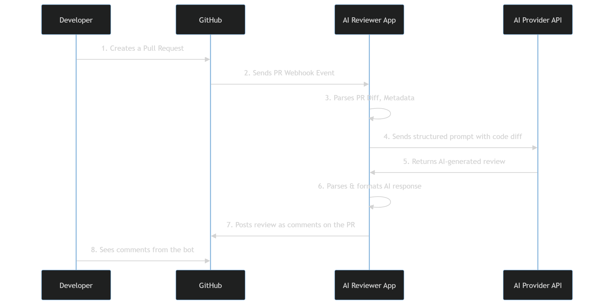

# Документация проекта: AI Code Reviewer Bot

**Дата создания:** 21 ноября 2025
**Дедлайн:** 25 ноября 2025, 23:59

## 1. Описание проекта

**AI Code Reviewer Bot** — это автономный сервис, который интегрируется с GitHub и автоматически проводит ревью Pull Request (PR) с использованием моделей искусственного интеллекта.

### 1.1. Что будет видеть пользователь?
1. **Создание PR:** Пользователь создает Pull Request в репозитории на GitHub обычным способом.
2. **Автоматический триггер:** Создание PR автоматически тригеррит наш сервис.
3. **Комментарии от бота:** В течение нескольких минут в PR появляются комментарии от бота-ревьювера
   - TODO придумать промт/параметры типа: критические, улучшения, кодстайл и тп

## 2. Архитектура и схемы взаимодействия

### 2.1. Схема работы

### 2.2. Компоненты

## Задачи

- узнать как вообще тригериться от пуша в пр
- достать из пр дифф с веткой от которой ответвлён (или мэйна)
- найти, пристроить апи того же дипсика
- разработать промт-инструкцию
- наладить парсинг после получение фидбека
- добавить комментарии к пр

[Гитхаб](https://github.com/45161846/neuro-review)